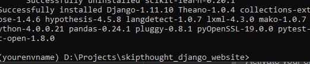
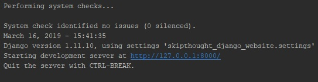

# Skippy
Skippy, a final year project for the University of the West of England. This project allows the users to host and run a django production server that implements personally trained skip-thought vectors to make an extractive summeriser tailored for news articles that takes any url or text.txt files encoded in UTF-8 and returns summary using sentence embeddings and various user set arguments like compression rate and including list elements in webpages.

The summariser itself can be found [here](https://github.com/William-Blackie/Extractive_Skip-thought_Summeriser) as a stand alone module with instructions for training,

## Getting started
To get started you will need:

### Hardware
For Skippy:
* 8GB of ram, more is better.
* A recent CPU
* Around X of storage.

For training Skip-Thought vectors:
* please see my [Skip-Thought Extractive Summariser repo](https://github.com/William-Blackie/Extractive_Skip-thought_Summeriser) for instructions.


### Software

[git bash](https://gitforwindows.org/) - to clone the repo.

[Anaconda Python 2.7](https://www.anaconda.com/distribution/) - to be able to run the server.

[CUDA 9.0](https://developer.nvidia.com/cuda-90-download-archive)  - to be able to run Theano (used for training and summation)

[CUDNN 7.42](https://developer.nvidia.com/rdp/cudnn-archive) - CUDA updates used in Theano, the files need to be placed in the installation directory of CUDA.

## Cloning the repo
Using git bash:
```
    git clone https://github.com/William-Blackie/skip-thought_django_website
```

## Installation
## Theano
Theano requires environment variables to be set, which can be done programmatically but for ease of please save the following into your home directory as theanorc.txt:

Please make sure the cuda and dnn paths match your own installation.
```
[global]
floatX = float32
device = cpu
force_device = True
allow_gc = True
allow_pre_alloc = False

[theano]
exception_verbosity=high

[cuda]
root = C:\Program Files\NVIDIA GPU Computing Toolkit\CUDA\v9.0
CUDA_LAUNCH_BLOCKING=1 

[nvcc]
fastmath = True

[dnn] 
library_path = C:\Program Files\NVIDIA GPU Computing Toolkit\CUDA\v9.0\lib\x64
include_path = C:\Program Files\NVIDIA GPU Computing Toolkit\CUDA\v9.0\include
enabled = True

[mkl]
MKL_THREADING_LAYER=GNU
```

## Anaconda
Open the terminal and follow the bellow instructions.

Navigate to the root of the cloned project and run to create a conda environment for the project:
```
  conda env create -n skippy_env -f environment.yml
```

Activate your environment:
```
  conda activate skippy_env
```


you should see something like this:

<p>
    
</p>

Create migrations:
```
  python manage.py migrate
```

run make migrations:
```
  python manage.py makemigrations
```

run your new server:
```
  python manage.py runserver
```

If all went well you should see something like this:

<p>
    
</p>

open Skippy! 

Paste the following into your chosen web browser:
```
  localhost:8000
```

## Basic usage
### Summarise a text file
Select summarise in the navigation bar, select the upload button and select English text.txt encoded in UTF-8, select your compression rate for the text(optimal is 0.3) and wait for the article to be summarised!


### Summarise a URL
Select summarise in the navigation bar and paste an English URL, select your compression rate for the text(optimal is 0.3) and wait for the article to be summarised!

Note that summation will take some time depending article length and a higher compression rate, having a recent CPU will help but this project will benefit greatly from being properly deployed.
### About page
Some more information about the project.

### Research 
A basic summary of my project and the implementations details including more information on relevant papers.
## Authors

* **William Blackie** - [Github](https://github.com/William-Blackie) - Email: contact@williamblackie.com


## License

This project is licensed under the apache 2.0 license - see the [here](http://www.apache.org/licenses/LICENSE-2.0) file for details.

If you choose to extend this project please give credit to the training material sources as well as the original authors and a link to this project.

## Acknowledgments

* This project uses a research implementation by [Kiros, Ryan and Zhu, Yukun and Salakhutdinov, Ruslan and Zemel, Richard S and Torralba, Antonio and Urtasun, Raquel and Fidler, Sanja](https://github.com/ryankiros/skip-thoughts) of Skip-Thought to create and train my vectors and the encoding of sentences into vectors. For more information please read their paper [here.](https://arxiv.org/abs/1506.06726)
* This project implemented FaceBook's [FastText vectors](https://fasttext.cc/docs/en/crawl-vectors.html) used in the vocabulary expansion step after training.
* The corpus used in training of my vectors was a full dump of a [english Wikipedia](https://dumps.wikimedia.org/), of which a sample was taken.
